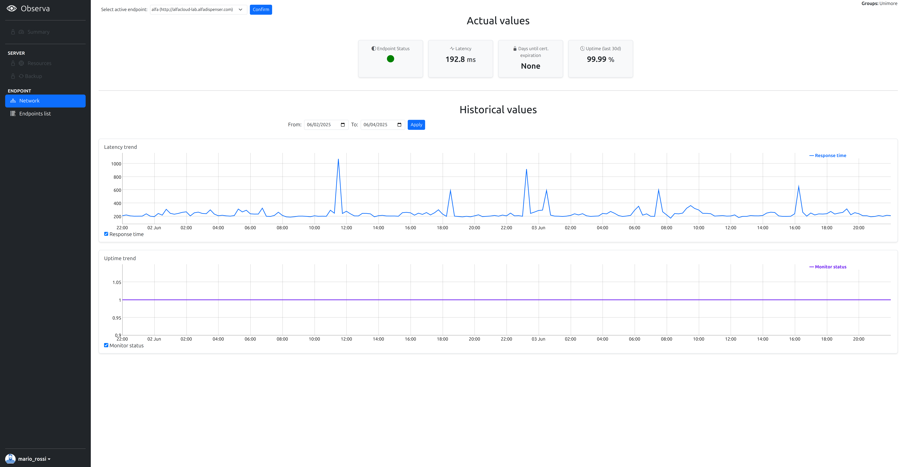
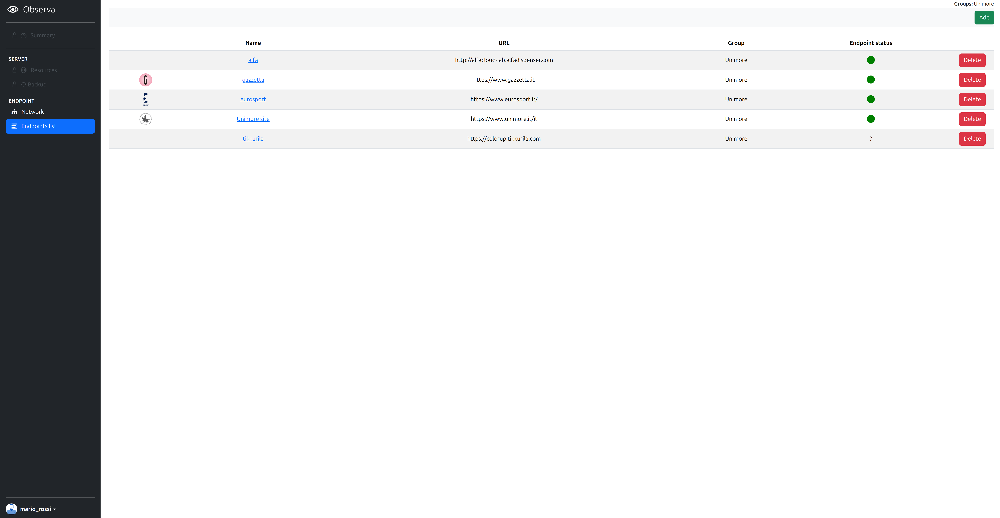
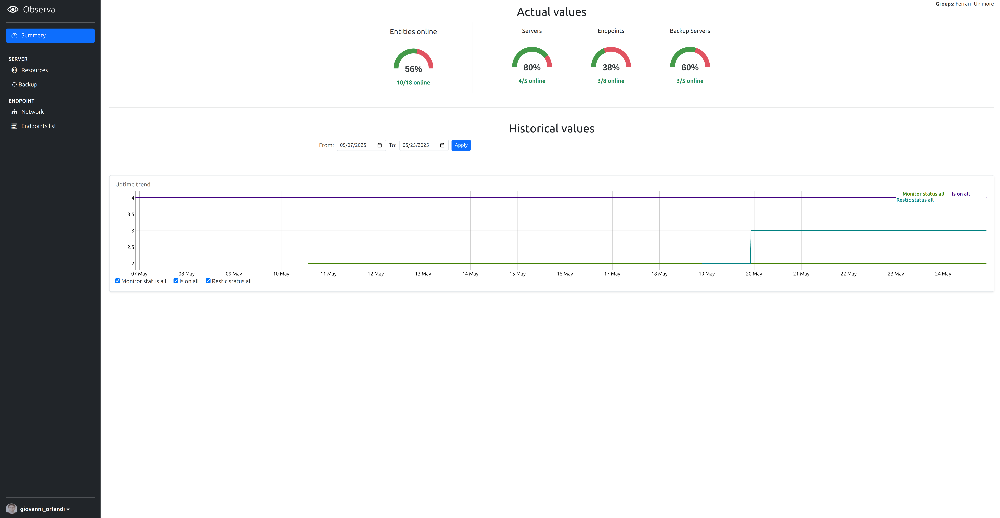
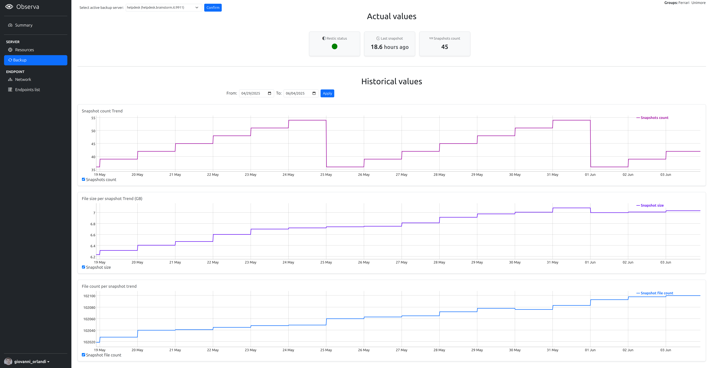

<h2> Progetto Tecnologie Web </h2>
<h1 align="center">Observa</h1>

Giovanni Orlandi / A.A. 2024-2025

- [Obiettivo](#obiettivo)
- [Targets della supervisione](#targets-della-supervisione)
- [Tecnologie selezionate](#tecnologie-selezionate)
- [Livelli di Servizio](#livelli-di-servizio)
  - [Versione Free (Accesso gratuito previa registrazione)](#versione-free-accesso-gratuito-previa-registrazione)
  - [Versione Pro](#versione-pro)
  - [Funzionalità comuni](#funzionalità-comuni)
- [Criticità e Strategie Realizzative](#criticità-e-strategie-realizzative)
  - [Principali criticità individuate](#principali-criticità-individuate)
  - [Strategia proposta](#strategia-proposta)
  - [Requisiti per l'integrazione](#requisiti-per-lintegrazione)
- [Schermate principali](#schermate-principali)
  - [Pagine accessibili anche agli utenti free](#pagine-accessibili-anche-agli-utenti-free)
  - [Pagine esclusive per gli utenti pro](#pagine-esclusive-per-gli-utenti-pro)

---

### Obiettivo

Il progetto consiste in un servizio web che offre una panoramica delle attività di supervisione di server e servizi web, aggregando diverse metriche significative e monitorandone l’evoluzione nel tempo attraverso una visualizzazione a vari livelli di granularità.  
Gli utenti target principali di questo progetto sono gli amministratori di sistema, ai quali viene fornito uno strumento essenziale per analizzare lo stato di salute dei server e facilitare il monitoraggio di un ampio numero di macchine e parametri all'interno di un'unica applicazione web.

### Targets della supervisione

La supervisione si applica a tre possibili entità:

- server remoti (entità **Server**)
- servizi web remoti (entità **Endpoint**)
- server che si occupano dei backup (entità **Server** con flag *is_backup*)

che potranno essere raggruppati per controllarne la visibilità da parte degli utenti autorizzati.

Le attività visualizzate dal sistema comprendono:

- rilevazione periodica e archiviazione del valore di parametri vitali del server monitorato
- stato di avanzamento dei backup periodici incrementali dei server adibiti a backup
- verifica della disponibilità del server/servizio web remoto
- misure dei tempi di risposta del server/servizio web remoto

come di seguito dettagliato.

Tutte queste grandezze sono accessibili sia sotto forma di serie storiche, visualizzate tramite grafici riepilogativi, sia come valori puntuali dettagliati.

### Tecnologie selezionate

Il progetto è stato realizzato utilizzando esclusivamente tecnologie open-source, riassunte nella seguente tabella.

| Funzionalità                                           | **Tecnologia**  | **Tipo di Software**         | **Lingua di Programmazione** | **Utilizzo Tipico**                            |
| ------------------------------------------------------ | --------------- | ---------------------------- | ---------------------------- | ---------------------------------------------- |
| Observa - backend                         | **Django**      | Web Framework                | Python                       | Framework per siti web e app web complesse       |
| Observa - frontend                        | **HTMX**        | Libreria frontend            | HTML + JS                    | Web app dinamiche senza SPA, interazione AJAX  |
| Raccolta e analisi di metriche in tempo reale          | **Prometheus**  | Sistema di monitoraggio      | Go                           | Monitoraggio di sistemi, server e applicazioni |
| Statistiche e realizzazione di backup incrementale di dati                   | **Restic**      | Strumento di backup          | Go                           | Backup automatizzato di file e directory       |
| Monitoraggio della disponibilità di siti e servizi web | **Uptime Kuma** | Monitoraggio dell’uptime     | JavaScript (Node.js)         | Ping di servizi web, notifiche di down         |

### Livelli di Servizio

Il progetto prevede due distinti livelli di utilizzo del servizio:

#### Versione Free (Accesso gratuito previa registrazione)

La versione gratuita consente agli utenti di accedere esclusivamente alla funzionalità di **monitoraggio della disponibilità di siti e servizi web**, con le seguenti caratteristiche:

- Definizione di un massimo di 10 end-point monitorati.
- Verifica periodica della raggiungibilità
- Misurazione del tempo medio di risposta

In generale, le informazioni e le statistiche disponibili in questa modalità sono limitate rispetto alla versione a pagamento.

#### Versione Pro

La versione Pro estende le funzionalità disponibili, offrendo:

- Accesso alla schermata di dashboard che riassume lo stato (attuale e passato) di tutte le entità dell'utente
- **Monitoraggio avanzato di siti e servizi web**, con supporto per un numero maggiore di end-point
- **Monitoraggio di server remoti** e delle loro risorse, di cui sono riportate qua le principali:
  - CPU
  - Memoria principale
  - Memoria secondaria
- Controllo anche sui **server di backup**, con la raccolta delle seguenti metriche:
  - Dimensione
  - Numero di snapshot
  - Numero di file in ogni snapshot
  - Ultimo timestamp

#### Funzionalità comuni

Indipendentemente dal livello di servizio sottoscritto, tutti gli utenti possono:

- Configurare autonomamente la lista degli end-point web da monitorare
- Gestire il proprio profilo personale, inclusa la possibilità di caricare una foto profilo.
- Associare un'immagine rappresentativa (ad esempio un logo) a ciascun end-point monitorato, per facilitarne l'identificazione visiva.

### Criticità e Strategie Realizzative

Il progetto si pone come obiettivo principale la realizzazione di una **visione sinottica delle attività di supervisione**, sfruttando appieno le funzionalità offerte da **Prometheus**, **Restic** e **Uptime Kuma**.  
A queste tecnologie è delegata in modo completo la raccolta e l’archiviazione delle metriche, mentre il sistema sviluppato si configura principalmente come un **layer di presentazione**.

È stata compiuta una **scelta progettuale consapevole** volta a **evitare la duplicazione** di dati o funzionalità già offerte da questi strumenti.  
L’interfaccia utente è quindi progettata per **mascherare l’eterogeneità tecnologica** sottostante e fornire una **rappresentazione coerente e normalizzata** delle informazioni.

#### Principali criticità individuate

Le decisioni architetturali comportano alcune criticità:

- **Eterogeneità nei formati di archiviazione**: ogni strumento adotta logiche e formati proprietari per la memorizzazione dei dati.
- **Diversità nei protocolli di comunicazione**: l’interfacciamento richiede il supporto a protocolli differenti.
- **Dipendenza tecnologica**: un eventuale cambiamento in una delle tecnologie implicherebbe modifiche anche alla logica di presentazione.

Nonostante possa sembrare vantaggioso archiviare localmente le metriche storiche, ciò introdurrebbe complessità e duplicazioni, in contrasto con i principi di **leggerezza e manutenibilità** del progetto.

#### Strategia proposta

Per mitigare le criticità, è stata realizzata un’**API interna** che funge da mediatore tra il frontend e Prometheus, designato come **unica fonte dati**.  
Attraverso l’adozione di exporter specifici, Prometheus sarà infatti in grado di fornire direttamente anche informazioni provenienti da Restic e Uptime Kuma.

Questa scelta consente di:

- **Disaccoppiare il frontend dalla logica di raccolta delle metriche**, facilitando l’evoluzione futura del progetto.
- **Centralizzare l’accesso ai dati**, semplificando l’architettura e migliorando la manutenzione.

#### Requisiti per l'integrazione

L’utilizzo dell’applicazione presuppone che i server da monitorare abbiano già installato e configurato i servizi necessari (**Prometheus**, **Restic**, **Uptime Kuma**).  
Tale predisposizione è **a carico dell’utente**, e non è previsto un servizio di supporto per la configurazione.

In fase di registrazione di un nuovo server, si assume quindi che i dati siano già disponibili secondo le modalità previste.

Per quanto riguarda gli **endpoint web**, non essendo richiesto alcun prerequisito specifico, l’utente potrà registrarli liberamente.  
Essi verranno automaticamente aggiunti a Uptime Kuma tramite la sua API, rendendo immediatamente disponibile il monitoraggio.

### Schermate principali

Di seguito vengono illustrate alcune schermate rappresentative, accompagnate da una breve descrizione.

#### Pagine accessibili anche agli utenti free

- Dettaglio sui dati di un endpoint  
  

- Gestione e visualizzazione di tutti gli endpoint  
  

#### Pagine esclusive per gli utenti pro

- Dashboard riassuntiva  
  

- Monitoraggio singolo Server  
  

- Monitoraggio singolo Server di backup  
  

